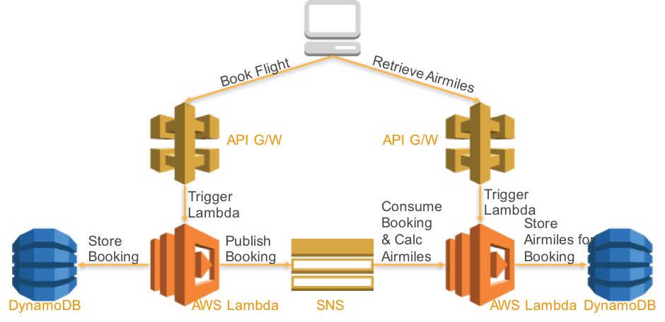

# Cross Account Microservices with CodePipeline, CodeBuild and Lambda

[][architecture]

## Deploying the serverless microservices sample application

#### 1. Pre-requisites

You will need three AWS accounts. One for the CodePipelines, one for the Bookings microservice and one for the Airmiles microservice

#### 2. Clone the sample Lambda function GitHub repository

[Clone](https://help.github.com/articles/cloning-a-repository/) the [AWS LAMBDA sample application](https://github.com/MCLDG/blg-svlss-msvc.git) GitHub repository.

From your terminal application, execute the following command:

```commandline
git clone https://github.com/MCLDG/blg-svlss-msvc.git
```

This creates a directory named `blg-svlss-msvc` in your current directory, which contains the code for the Serverless Microservices sample application.

#### 3. Prepare the bootstrap script that will execute the CloudFormation templates and create the cross stack CodePipelines

Change into the cloned directory, and edit the file single-click-cross-account-pipeline.sh

```commandline
vi single-click-cross-account-pipeline.sh
```

Change the following entries in lines 2-12, and save your changes:

```commandline
ToolsAccount=<AWS 12 digit account number for the Tools account, where the CodePipelines will be deployed>
ToolsAccountProfile=<AWS profile for the Tools account, as defined in ~/.aws/credentials>
BookingNonProdAccount=<AWS 12 digit account number for the Booking account, where the Booking microservice will be deployed>
BookingNonProdAccountProfile=<AWS profile for the Booking account, as defined in ~/.aws/credentials>
AirmilesNonProdAccount=<AWS 12 digit account number for the Airmiles account, where the Airmiles microservice will be deployed>
AirmilesNonProdAccountProfile=<AWS profile for the Airmiles account, as defined in ~/.aws/credentials>
region=<e.g. us-east-1. Must be a region where CodeCommit, CodePipeline, CodeBuild and other required services are supported)
S3_TMP_BUCKET=<name of a bucket you have access to, that can be accessed by all three accounts>
```

#### 4. Execute single-click-cross-account-pipeline.sh

From your terminal application, execute the following command:

```bash
./single-click-cross-account-pipeline.sh
```

This will create stacks in all three accounts. Wait until all stacks are successfully created.

#### 5. Copy the microservice source code and push to AWS CodeCommit

In the AWS Console, in the Tools account, in the region specified in single-click-cross-account-pipeline.sh, select
the CloudFormation service and find the 'booking-pipeline' stack.

Copy the value of this stack output variable: SourceCodeCommitCloneUrlHttp
In a directory in your terminal application where you want to clone the application repository, execute the commands below. 
Note that this clones an empty GIT repo for the Booking microservice, into which you'll copy the Booking source code from 
the blg-svlss-msvc.git repo (you may have to adjust the cp -R statement below if you use a different directory structure):

```bash
git clone <value of the SourceCodeCommitCloneUrlHttp stack output variable>
cp -R blg-svlss-msvc/Booking/ <cloned repo directory>/
cd <cloned repo directory>
git add .
git commit -m 'new'
git push
```

It's quite important to use the 'cp' command as specified above, to make sure you do not overwrite the .git file that will already
exist in the directory you cloned into.

This will push the source code for the Booking microservice to CodeCommit, and trigger the booking CodePipeline. You can
find the CodePipeline in the AWS console by clicking the value of the PipelineUrl stack output variable in the 'booking-pipeline' stack

#### 6. Monitor deployment of the Booking microservice

In the AWS Console, in the Tools account, monitor the progress of the 'booking-pipeline' CodePipeline. Once the pipeline reaches the
DeployToTest stage, you can login to the Booking account in the AWS Console and view the status of the CloudFormation
deployment.

#### 7. Repeat steps 5 & 6 for the Airmiles microservice

Wait until the Booking CodePipeline is complete, then repeat steps 5 & 6 for the Airmiles microservice, using the stack
output values from the 'airmiles-pipeline' stack. Change the folder in the 'cp' statement from Booking to Airmiles.

#### 8. Confirm the API endpoints for Booking & Airmiles

Using the stack output values from booking-lambda and airmiles-lambda (in the booking and airmiles accounts), get
the value of the API endpoint (BookingAPI and AirmilesAPI). Check that you can POST a request to the API:

```bash
curl -H "Content-Type: application/json" -X POST -d '{"first_name":"Michael","last_name":"Surgeon","from_airport":"DEL","to_airport":"MEL","booking_class":"Economy","departure_date":"12/04/2017","return_date":"21/04/2017","age_group":"Adult"}' https://lv71x6qei8.execute-api.us-east-1.amazonaws.com/Prod/bookings
```

this should return a booking_number, such as "7NIXnSSI". You can follow this up with a GET on the API endpoint:

```bash
curl <BookingAPI stack output value>/Prod/bookings, e.g. curl https://lv71x6qei8.execute-api.us-east-1.amazonaws.com/Prod/bookings
```

after posting to bookings, the booking information should flow via SNS to airmiles, so check the airmiles endpoint for the booking_number

```bash
curl https://4oiogvmtpa.execute-api.us-east-1.amazonaws.com/Prod/airmiles/7NIXnSSI
```

### Troubleshooting
If you receive an error, such as the one below, while running single-click-cross-account-pipeline.sh,  
it could be related to the version of awscli you are using. For instance, I received the error below:

```
$ ./single-click-cross-account-pipeline.sh 
creating pre-reqs stack for booking

'list' object has no attribute 'split'
```

when using this version of the awscli:

```
$ aws --version
aws-cli/1.11.44 Python/2.7.12 Linux/4.9.38-16.35.amzn1.x86_64 botocore/1.5.7
```

After upgrading awscli to the latest version, the issue was resolved:

```
$ aws --version
aws-cli/1.11.142 Python/2.7.12 Linux/4.9.38-16.35.amzn1.x86_64 botocore/1.7.0
```


[code-commit-url]: https://aws.amazon.com/devops/continuous-delivery/
[code-build-url]: https://aws.amazon.com/codebuild/
[code-pipeline-url]: https://aws.amazon.com/codepipeline/
[clouformation-url]: https://aws.amazon.com/cloudformation/
[lambda-url]: https://aws.amazon.com/lambda/
